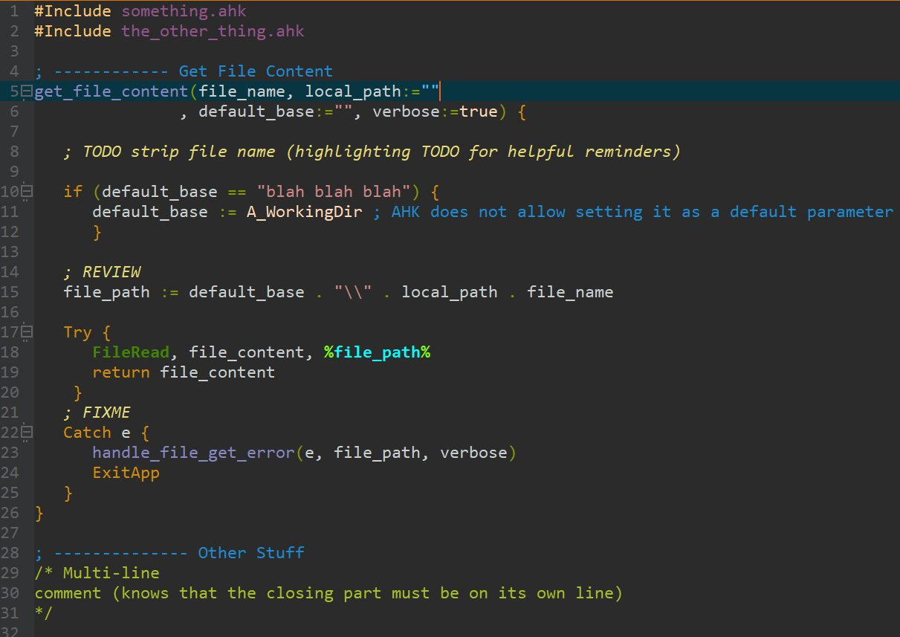
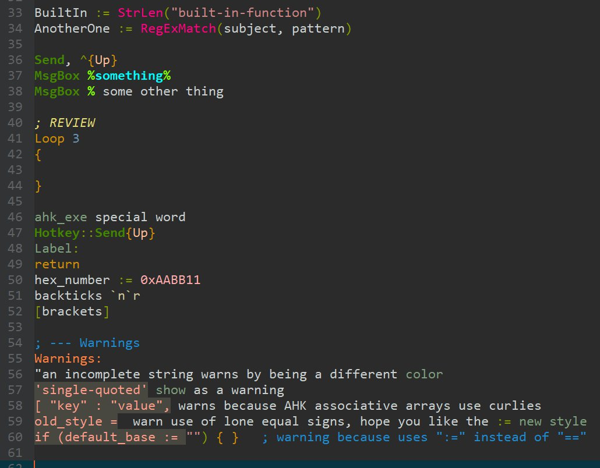

# TL;DR This scheme was made specifically for EditPad Pro using the MishMash color palette

1. If you don't have EditPad **[click here for a free trial](http://yu8.us/eppdemo)**

2. If you want this scheme to look good, first install the [MishMash color palette](https://github.com/boolbag/EditPad-Goodies/tree/master/Making%20Text%20Pretty%20-%20Syntax%20Coloring%20and%20Color%20Palettes/Color%20Palettes/MishMash) into EditPad.

## Here are two screenshots that will give you a sense of the scheme

Just so you know, I may have changed the scheme slightly since making the screenshots.

### Screenshot 1

### Screenshot 2

What is AutoHotkey for MishMash in EditPad Pro?
==

This syntax-coloring scheme was created so I could handle a large AutoHotkey project — many files, many functions — in EditPad Pro. What drove me to this was that none of the existing solutions that I tried worked for me: either I couldn't navigate the code, or the IDE repeatedly lost my code. Losing code several days in a row motivated me to look for a solution in EditPad Pro, my text editor of choice, which has never messed with my files.

## How to Install?

1. Don't have EditPad Pro? Get the **[click here for a free trial](http://yu8.us/eppdemo)**

2. Installing the actual syntax-coloring scheme
 
   * Semi-Automatic Method. Like for all other syntax-coloring schemes, within EditPad, go to _Options / Configure File Types / Colors and Syntax Tab / Syntax Coloring Scheme pull-down menu_ and hit _Download_.

   * Manual Method: drop the `.jgcscs` file at the top of this page into the `%APPDATA%\JGsoft\EditPad Pro 7` folder (to navigate to that folder, copy that path and paste it in the address bar of your file manager, e.g. Windows Explorer)

## Why I Believe EditPad Pro is the Best Environment for Large AHK Projects

- EPP does not randomly decide to revert your files behind your back!
- Indentation — spaces or tabs, you choose.
- Bookmarks that work with hotkeys that work.
- Split a file into two editing windows, and _it just works_.
- Split function definitions across multiple lines — they still show in the File Navigator (_Function Browser / Project Explorer_)
- Doesn't mess with your indentation!
- No multiple carets (huge source of messed up files in AHK Studio)
- File Navigator lets you see functions for **each file** in the project (not hundreds of functions of all your includes at once)
- Awesome Search-and-Replace (JGSoft has one of the best regex engines out there)
- The cursor doesn't jump around
- All the amazing features of EditPad

##### The "Weak" Points

Honestly, for me there are none.

- No code completion (for me that's a benefit, these pop-ups drive me mad)
- No built-in compile options (but I set up `Ctrl + F7` to compile my current project, so no worries.)

## Some Features of the Scheme You Might Like to Note

1. The scheme checks certain dodgy syntax and highlights with the Warning color (see preview above)
2. You can use the `; TODO` / `; FIXME` / `; REVIEW` convention: the scheme highlights those as hints.

## How I generated the Token-Matching Patterns 

1. Churned several lists through Python script
see [this tool](https://github.com/boolbag/Autohotkey-Goodies/tree/master/AHK%20Syntax%20Summarizer)
2. Reduced the regex alternations via Perl Regexp::Assemble::Compressed

## Credits
 
1. Raw lists of tokens: [SciTE4AHK](https://www.autohotkey.com/boards/viewtopic.php?t=62), [Sublime Autohotkey](https://github.com/ahkscript/SublimeAutoHotkey)
2. A few of the expressions (strings, numbers) were imported from Jan's Csharp scheme 

